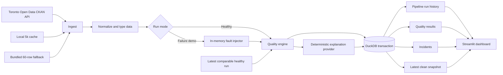

# TrustLayer: Data Reliability Copilot

TrustLayer is a résumé-ready, local data-observability MVP that ingests real Toronto transit data, normalizes it, stores an analytics snapshot in DuckDB, evaluates a documented quality contract, and translates problems into plain-language incident guidance in Streamlit.

It is a working application, not a mockup: the pipeline downloads public data, writes audit history, detects controlled failures, and restores a healthy snapshot without Docker, cloud accounts, authentication, or API keys.

## The business problem

Dashboards can be visually correct while the data behind them is incomplete, stale, duplicated, or structurally broken. TrustLayer makes those risks visible before a dataset is used for reporting. It answers four practical questions:

1. Is the latest dataset healthy enough to use?
2. What changed from the latest comparable healthy run?
3. Why could the change matter to a business user?
4. What should an analyst or data engineer check next?

## Verified MVP snapshot

Verified locally on **September 30, 2026**:

- **5,000** newest records cached from a **45,475-row** official TTC source file
- **11** automated quality checks, all passing in the restored healthy run
- **9** failed checks triggered by the controlled live-size failure demo
- **13** automated tests passing
- **100/100** healthy-run score; **18.2/100** controlled failure-demo score
- Streamlit application test passed and the running server returned HTTP `200` from `/_stcore/health`

These are observed application results, not projections or claims of business impact.

## Key features

- Programmatic Toronto Open Data catalogue lookup and download
- Newest-first, 5,000-row local cache for fast repeatable demos
- Authentic 60-row bundled fallback for offline startup
- Type and schema normalization without hiding invalid source values
- Atomic DuckDB persistence for runs, results, incidents, and the latest clean snapshot
- Historical baselines scoped to the same source resource, excluding simulated runs
- Eleven deterministic quality rules with pass, warning, and fail states
- Offline incident explanations with impact, possible causes, and next actions
- Four polished dashboard views: Overview, Quality Results, Incidents, and Data Explorer
- Reusable "Measured Field" interface with warm neutral surfaces, restrained teal accents,
  and native light, dark, and system themes
- Responsive card layouts, visible focus states, redundant status labels, and chart-data
  alternatives for accessible review
- Safe failure injection that mutates only an in-memory copy
- Fully tested healthy → simulated failure → restore workflow

## Architecture



The clean snapshot is replaceable and idempotent; audit tables are append-only by run. A simulated run cannot become a future healthy baseline.

## Technology choices

| Technology | Why it fits the MVP |
|---|---|
| Python 3.11+ | Portable local runtime and straightforward CLI orchestration |
| Pandas | Reliable parsing, normalization, sampling, and test fixtures |
| DuckDB | Embedded analytical SQL with no server or account |
| Streamlit | Fast, professional local data application |
| Plotly | Responsive time-series and quality-history charts |
| Pytest | Unit, integration, persistence, and UI smoke tests |
| Ruff | Fast formatting and static checks |

## Dataset, licence, and attribution

TrustLayer uses the City of Toronto's [TTC Subway Delay Data](https://open.toronto.ca/dataset/ttc-subway-delay-data/). The pipeline resolves the current tabular resource through the public [CKAN package API](https://ckan0.cf.opendata.inter.prod-toronto.ca/api/3/action/package_show?id=ttc-subway-delay-data), selects the newest supported resource, parses it, sorts by source date, and caches only the newest 5,000 rows.

The verified source resource was **TTC Subway Delay Data since 2025.csv**, last modified September 21, 2026, with 45,475 rows and data through August 31, 2026. The cached sample covers June 29 through August 31, 2026.

> Contains information licensed under the Open Government Licence – Toronto.

See the [Open Government Licence – Toronto](https://open.toronto.ca/open-data-licence/). The bundled fallback is an unmodified 60-row excerpt from the same resource; its provenance is recorded in [`data/sample/README.md`](data/sample/README.md).

## Quality-check methodology

Every result stores the rule name, status, observed value, expected threshold, explanation, and run timestamp.

| Check | Passing contract | Warning | Failure |
|---|---|---|---|
| Required columns | All 10 TTC business columns exist | — | Any required column missing |
| Minimum row count | At least 50 rows | — | Fewer than 50 rows |
| Primary ID uniqueness | No duplicate surrogate incident IDs | — | Any duplicate ID |
| Critical missingness | At most 1% across date, station, code, and delay | Over 1% | Over 5% |
| Numeric ranges | Delay 0–500 min; gap 0–600 min | — | Any populated value outside bounds |
| Allowed categories | Day is Monday through Sunday | — | Any unexpected populated label |
| Date parsing | Every source date parses | — | Any invalid date |
| Freshness | Newest record is at most 45 days old | Over 45 days | Over 75 days |
| Duplicate rows | At most 0.5% repeated business rows | Over 0.5% | Over 2% |
| Row-count change | Drop is at most 20% from the healthy baseline | Drop over 20% | Drop over 40% |
| Delay distribution | Mean delay shifts at most 50% | Shift over 50% | Shift over 100% |

The monthly publication cadence supports the 45/75-day freshness policy. `Bound` and `Line` are not treated as critical because blanks are legitimate in the official data. On a first comparable run, historical checks pass while establishing a baseline. The health score is intentionally simple and explainable: passed = 1, warning = 0.5, failed = 0, averaged equally across rules. It is a rule score, not statistical confidence.

## Project structure

```text
app.py                         Streamlit application
src/ui.py                      Reusable Measured Field presentation helpers
assets/trustlayer.css          Design tokens and responsive interface styling
src/config.py                  Paths, source metadata, thresholds
src/ingest.py                  CKAN download, parsing, cache, fallback
src/transform.py               Schema normalization and fault injection
src/quality.py                 Eleven quality checks and health score
src/explain.py                 Deterministic explanation interface/provider
src/database.py                DuckDB schema, transactions, read queries
src/pipeline.py                CLI orchestration
src/models.py                  Shared domain models
tests/                         13 unit/integration/UI tests
data/sample/                   Licensed fallback excerpt and provenance
.streamlit/config.toml         Native light/dark theme definitions
DESIGN_SYSTEM.md               Reusable visual and interaction rules
ROADMAP.md                     Deliberately deferred improvements
```

## Setup on Windows PowerShell

From the project root, with Python 3.11 or newer installed:

```powershell
python -m venv .venv
Set-ExecutionPolicy -Scope Process Bypass
.\.venv\Scripts\Activate.ps1
python -m pip install -r requirements.txt
```

If you prefer not to activate the environment, replace `python` below with `.\.venv\Scripts\python.exe` and `streamlit` with `.\.venv\Scripts\streamlit.exe`.

## Run the healthy pipeline

The first command queries Toronto Open Data and creates the cache. If the source is unavailable, TrustLayer automatically uses a prior cache or the bundled fallback.

```powershell
python -m src.pipeline --force-refresh
```

Normal repeat runs use the cache and remain fast:

```powershell
python -m src.pipeline
```

Explicit offline mode is also available:

```powershell
python -m src.pipeline --offline
```

## Start the dashboard

```powershell
streamlit run app.py
```

The Overview should show 5,000 records, 11 passing checks, 0 warnings, 0 failures, and a 100/100 score when the verified cache is present.

Use the Streamlit **⋮** menu to switch between System, Light, and Dark under **Theme**.

## Failure-demo walkthrough

Keep Streamlit running in one PowerShell window and use a second window from the same project root.

1. Create or restore the healthy state:

   ```powershell
   python -m src.pipeline
   ```

2. Inject controlled problems into a separate in-memory copy:

   ```powershell
   python -m src.pipeline --simulate-failures
   ```

3. Click **Refresh data** in the dashboard. The verified demo shows 1,650 records, nine failed checks, and structured incident explanations for nulls, duplicates, invalid categories/numbers/dates, staleness, volume loss, and distribution shift.

4. Restore the healthy latest snapshot:

   ```powershell
   python -m src.pipeline
   ```

5. Refresh the dashboard again. Historical failed results remain available in the run selectors, while the latest state returns to healthy.

The fault injector deep-copies the transformed frame. It never edits the official download, local cache, or bundled fallback.

## Testing and code quality

```powershell
pytest
ruff check .
ruff format --check .
```

The 13 tests cover:

- Healthy and intentionally broken datasets
- Required columns, uniqueness, missingness, ranges, categories, dates, freshness, duplicates, volume change, and distribution shift
- Deterministic incident explanations and required business fields
- DuckDB run/result/incident persistence
- Exclusion of simulated runs from healthy baselines
- End-to-end healthy → broken → restored behavior
- Proof that simulation does not mutate its input
- Streamlit rendering through `streamlit.testing.v1.AppTest`

## Incident explanation design

`src/explain.py` defines an `ExplanationProvider` protocol. The default `DeterministicExplanationProvider` uses transparent check-specific playbooks and requires no network call. Each incident contains:

- What changed
- Why it may matter
- Likely causes, phrased as possibilities
- A recommended next action

The dashboard labels these outputs “incident explanations” and “copilot summaries”; it does not claim that deterministic text is LLM-generated. A future provider can implement the same interface without changing pipeline persistence or UI code.

## Current limitations

- The MVP intentionally analyzes the newest 5,000 records, not the entire historical archive.
- The public source has no durable business primary key; TrustLayer generates a run-local surrogate using source fields and row position.
- Thresholds are transparent heuristics for this dataset, not learned service-level objectives.
- Mean shift is a lightweight distribution signal; production use would benefit from seasonality-aware tests such as PSI or Wasserstein distance.
- DuckDB stores every run, result, and incident, but keeps only the latest cleaned record-level snapshot.
- The app is single-user and local; there is no scheduler, alert routing, access control, or remote state.
- The fallback excerpt will age and may eventually raise a truthful freshness incident when used far in the future.

## What this project demonstrates

- End-to-end ownership from public-source ingestion to a decision-ready UI
- Data contracts, observability rules, safe incident simulation, and auditability
- Pragmatic local architecture with clear seams for future providers and orchestration
- Automated testing across data logic, persistence, workflow behavior, and Streamlit rendering
- Careful handling of unreliable networks, baseline contamination, and source provenance

## Résumé-ready bullet

> Built and validated a local Python/DuckDB/Streamlit data-reliability copilot that ingests and caches 5,000 current Toronto TTC delay records, executes 11 persisted quality checks, generates deterministic incident playbooks, and passes 13 automated tests.

## Future improvements

See [`ROADMAP.md`](ROADMAP.md) for scoped next steps. Kafka, Airflow, Spark, Kubernetes, and cloud infrastructure are intentionally outside this MVP.
